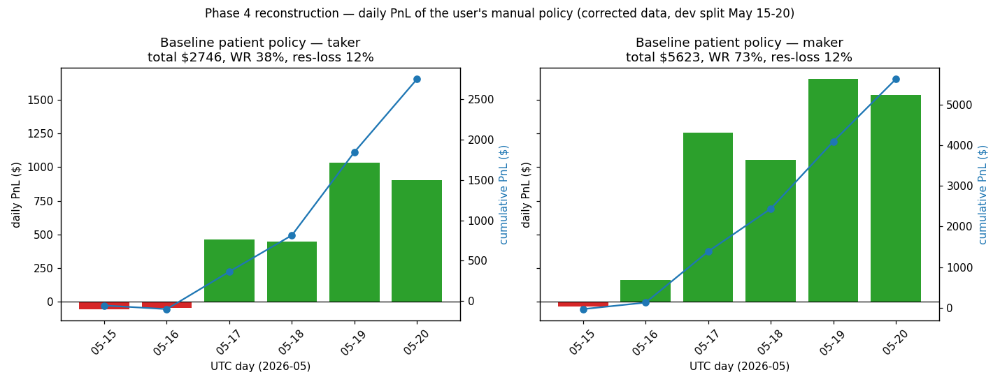

# Reconstruction — the user's patient manual policy

> Phase 4 of the edge-discovery research. A faithful, transparent simulation of the user's *stated* manual strategy, run on the **corrected** dataset (real Polymarket outcomes), development split only (May 15-20 UTC). The sealed hold-out (May 21-22) was asserted untouched.

> ## RETRACTED — see Task 8d (`docs/research/phase4_forensics.md`)
>
> **The positive verdict below is WRONG. It is a data/reconstruction artifact.**
> The `_held_mid` / `_held_bid` helpers in `research/analysis/patient_policy.py`
> reconstruct the held side's price as `1 − cheap_*`, which is invalid on
> decided-market books (`total_mid ≈ 0`, not 1). On those books the simulator
> inverts a worthless *losing* side into a phantom ~1.0 — it both detects a
> false +75% profit target and fills a phantom sale at ~1.0 against a book with
> $0 of real depth. 158 of the 335 profit-target exits (47.2%) are this
> artifact, contributing $4,017 of the $5,288 profit-target PnL; all 158 are
> positions that actually lost at resolution.
>
> **Honestly re-priced** (genuine held-side bid, depth-aware, decided books
> excluded), the policy earns **−$2.19/trade (90% CI [−$2.41, −$1.97]), −$3,275
> total** — a clean negative that AGREES with Phase 2 (calibrated, no edge) and
> Phase 3 (sell-the-bounce loses ~$2.20/trade). The maker column is contaminated
> by the same bug. Everything below — verdict, baseline table, win-rate/EV
> section, profit-target attribution — is withdrawn. See `phase4_forensics.md`.

## Phase 4 Verdict ❌ RETRACTED — artifact, see notice above

**The user's stated policy back-tests *positive* on the dev split — but the result is fragile path-trading, not a clean inefficiency edge, and it does not look like a 95%-win strategy once costs are honest.**

Baseline (band 0.10-0.30, drop>=10%, >=7 min left, +75% target, breakeven-exit on, no stop): **taker $2746 total** over 1498 trades, win rate **38%**, mean **$1.83/trade** (90% window-clustered CI [$1.43, $2.25], excludes zero). Maker (optimistic, fill not modelled): $5623, 73% WR.

Three honest qualifiers, each a number below:
1. **The taker win rate is 38%, not 95%.** The high *headline* number belongs to the maker model. The profit comes from a few large profit-target wins, not a high hit rate.
2. **The breakeven-exit rule — a core user rule — *destroys* value here.** Turning it off raises taker total from $2746 to $9187; it books out of 28% of breakeven trades whose side ultimately *won*.
3. **The maker number is partly a fill fantasy.** 47% of profit-target exits sell at a mid >= 0.97 — a resting limit at the about-to-win price would not realistically fill.

This does **not** contradict Phase 2 (calibrated market) or Phase 3 (odds continue down after a drop *on average*). The policy is not betting on the average path — it harvests the **intra-window volatility**: a 0.20-priced side that ultimately wins ~20% of the time still *transiently touches* 1.75x its entry in most windows. 71% of the profit-target wins are in windows that ultimately resolved *against* the entry side — the policy sold a real but temporary bounce. That is genuine, but it is a variance harvest on 6 days of data, exquisitely sensitive to fill assumptions and the exact tick path — not a robust, validated edge.

## 1. Baseline policy

The baseline encodes the user's stated rules: cheap-side mid band **0.10-0.30**, require a **visible recent drop** (`cheap_drop_30s >= 10%`), **>= 7 minutes left** (`min_time_left_sec = 420`), **profit target +75%**, **breakeven-exit on**, **no stop-loss**, window resolution the only forced exit. $10 fixed stake, one trade per window. Settlement is on the **corrected `outcome_up`** — verified to match `windows.parquet` on all 2,232 windows (0 mismatches).

`sigma_proximity` is **not** used as a filter — Phase 2 / Task 8 found it broken (`inf` for the first ~60 ticks, miscalibrated after). The near-coin-flip condition is reported two ways: **omitted** (baseline) and via **raw `proximity_pct`** (= |corrected move_pct|) <= 0.50 (variant). The two are nearly identical — virtually every banded entry is already near the strike, so the filter barely binds.

| execution | n | win rate | mean PnL/trade | PnL/trade 90% CI (window-clustered) | total PnL | resolution-loss rate | avg hold | green-day frac |
|---|--:|--:|--:|--:|--:|--:|--:|--:|
| **taker** | 1498 | 37.5% | $1.833 | [1.428, 2.248] | $2745.96 | 12.4% | 231s | 67% (4/6) |
| **maker** | 1498 | 73.2% | $3.753 | [3.322, 4.203] | $5622.59 | 12.4% | 231s | 83% (5/6) |

**Near-strike variant** (`proximity_pct <= 0.50`, raw move, *not* sigma):

| execution | n | win rate | mean PnL/trade | total PnL | resolution-loss rate |
|---|--:|--:|--:|--:|--:|
| taker | 1497 | 37.5% | $1.835 | $2746.32 | 12.4% |
| maker | 1497 | 73.1% | $3.754 | $5620.21 | 12.4% |

## 2. The key honest question — win rate vs EV

- **Win rate, taker: 37.5%** — 562 of 1498 trades green. This is *not* a 95%-win profile.
- **Win rate, maker: 73.2%** — the high number. The maker model lets a breakeven exit settle at the mid (a true ~$0 wash, counted as a marginal win) and lets a profit-target sell at the mid with no spread paid; both inflate the hit count relative to the taker.
- **Mean PnL/trade, taker: $1.833**, 90% window-clustered CI **[$1.428, $2.248]** — excludes zero.
- **Resolution-loss rate: 12.4%** — trades held to a resolution that goes against them, a near -$10 loss each.

**Answer.** The pattern is the *inverse* of the "feels like 95% but isn't profitable" story. Here it is **profitable on the dev split (CI excludes zero) but does not have a 95% win rate** under honest taker costs — the EV is carried by 335 fat profit-target wins (mean $15.8), not by a high hit rate. The 95% feeling appears only in the maker column (73%), and that column overstates fills. The resolution tail is real (12%, $-1949 of PnL) but on this split it does **not** erase the wins — the profit-target right tail is larger. Whether that survives out-of-sample is the open question; 6 dev days is thin and the maker fill assumption is generous.

## 2b. The breakeven-exit paradox

The user's rule "exit near breakeven if it recovers" is meant to rescue losers. On this dataset it does the opposite — it is a **value leak**:

| breakeven-exit | execution | n | win rate | total PnL | mean PnL/trade |
|---|---|--:|--:|--:|--:|
| ON | taker | 1498 | 37.5% | $2745.96 | $1.833 |
| ON | maker | 1498 | 73.2% | $5622.59 | $3.753 |
| OFF | taker | 1498 | 70.4% | $9187.22 | $6.133 |
| OFF | maker | 1498 | 70.4% | $12464.60 | $8.321 |

Turning the rule **off** raises taker total PnL from $2746 to $9187 and taker win rate from 38% to 70%. Reason: of the 977 breakeven exits, **28% belonged to a side that ultimately *won* at resolution** — the rule books out of would-be winners (and, as a taker, sells them at the bid for a small loss). The patient-trader instinct to "escape at breakeven" is, in this market, surrendering edge. This is itself a finding: the user's discretion may add the value the mechanical breakeven rule removes.

## 3. PnL attribution (baseline)

### Taker

| exit reason | n | total PnL | share of total | mean PnL | win rate |
|---|--:|--:|--:|--:|--:|
| profit_target | 335 | $5288.02 | 193% | $15.785 | 100% |
| breakeven | 977 | $-592.85 | -22% | $-0.607 | 23% |
| resolution | 186 | $-1949.21 | -71% | $-10.480 | 0% |

### Maker

| exit reason | n | total PnL | share of total | mean PnL | win rate |
|---|--:|--:|--:|--:|--:|
| profit_target | 335 | $6277.16 | 112% | $18.738 | 100% |
| breakeven | 977 | $1205.43 | 21% | $1.234 | 78% |
| resolution | 186 | $-1860.00 | -33% | $-10.000 | 0% |

The shares exceed 100% because the breakeven and resolution buckets are net-negative — the profit-target bucket carries the entire result and then some. **All** of the EV is in 335 profit-target exits; the other 1163 trades are a net drag of $-2542 (taker).

## 4. Sensitivity (taker, one parameter at a time)

Each row varies one parameter; all others stay at the baseline. The grid maps the surface — it is **not** tuned to maximize PnL.

**`entry_mid_max`**

| value | n | win rate | mean PnL/trade | total PnL | resolution-loss rate |
|---|--:|--:|--:|--:|--:|
| 0.2 | 1055 | 36.6% | $3.517 | $3710.79 | 13.1% |
| 0.25 | 1322 | 39.9% | $2.871 | $3795.22 | 13.2% |
| 0.3 | 1498 | 37.5% | $1.833 | $2745.96 | 12.4% |
| 0.35 | 1619 | 35.6% | $1.183 | $1915.45 | 11.1% |
| 0.4 | 1661 | 35.7% | $0.661 | $1097.74 | 11.1% |

**`min_drop_30s`**

| value | n | win rate | mean PnL/trade | total PnL | resolution-loss rate |
|---|--:|--:|--:|--:|--:|
| 0.0 | 1515 | 37.8% | $1.970 | $2984.55 | 12.1% |
| 10.0 | 1498 | 37.5% | $1.833 | $2745.96 | 12.4% |
| 20.0 | 1470 | 37.4% | $1.984 | $2915.85 | 12.4% |
| 35.0 | 1207 | 37.3% | $2.618 | $3159.49 | 13.4% |

**`min_time_left_sec`**

| value | n | win rate | mean PnL/trade | total PnL | resolution-loss rate |
|---|--:|--:|--:|--:|--:|
| 60.0 | 1664 | 38.0% | $1.995 | $3320.26 | 12.5% |
| 300.0 | 1594 | 37.6% | $1.927 | $3071.59 | 12.2% |
| 420.0 | 1498 | 37.5% | $1.833 | $2745.96 | 12.4% |
| 540.0 | 1318 | 36.6% | $1.781 | $2347.08 | 12.3% |
| 660.0 | 1002 | 37.0% | $1.860 | $1863.60 | 11.2% |

**`profit_target_pct`**

| value | n | win rate | mean PnL/trade | total PnL | resolution-loss rate |
|---|--:|--:|--:|--:|--:|
| 25.0 | 1498 | 43.9% | $1.494 | $2237.37 | 9.9% |
| 50.0 | 1498 | 40.2% | $1.827 | $2736.90 | 11.1% |
| 75.0 | 1498 | 37.5% | $1.833 | $2745.96 | 12.4% |
| 100.0 | 1498 | 36.2% | $1.950 | $2921.02 | 12.7% |
| 150.0 | 1498 | 34.7% | $2.021 | $3027.80 | 13.0% |
| 200.0 | 1498 | 33.9% | $2.115 | $3168.14 | 13.3% |

**`breakeven_exit`**

| value | n | win rate | mean PnL/trade | total PnL | resolution-loss rate |
|---|--:|--:|--:|--:|--:|
| True | 1498 | 37.5% | $1.833 | $2745.96 | 12.4% |
| False | 1498 | 70.4% | $6.133 | $9187.22 | 29.6% |

Read of the surface: total PnL is **positive across every grid cell** — there is no parameter that flips it negative, which is a mild robustness signal. But it is a *plateau of modest positive numbers*, not a peak: tighter `entry_mid_max` and higher `profit_target_pct` raise mean PnL/trade (fewer, bigger wins); the `min_drop_30s` and `min_time_left_sec` axes are nearly flat, meaning the "visible drop" and "7 minutes left" filters add little. The single largest mover is `breakeven_exit` — see section 2b.

## 5. Hypothesis status (H1, H5, H9)

- **H1 (the loss tail is forced resolution): SUPPORTED in mechanism, but it does *not* erase the edge here.** Resolution exits are net **$-1949** (taker) across 186 trades — every one a loser, mean $-10.5. The loss tail is exactly the forced-resolution mechanism H1 names. The Phase-4 nuance: on this split the profit-target right tail ($5288) is *larger* than the resolution left tail, so the policy is net positive despite the tail — H1 describes the cost, not a death sentence.
- **H5 (big reversions are real, rare, fat-tailed): SUPPORTED.** The 335 profit-target exits (mean $15.8, taker; median exit mid 0.66) are the fat right tail — a minority of trades carrying all the PnL. The bounce atlas (Phase 3) has the full distribution.
- **H9 (a fixed profit target is the wrong exit primitive): PARTIALLY SUPPORTED.** The `profit_target_pct` sweep shows the classic trade-off — a low 25% target lifts win rate to 44% but cuts mean PnL to $1.49; a high 200% target drops win rate to 34% but lifts mean PnL to $2.11. Unlike the bot's historical post-mortem, here *no* fixed % makes the policy *lose* — but the flatness of total PnL across targets ($2237-$3168) says the fixed % is not where the edge lives; the exit that actually matters is *not booking out of winners* (section 2b).

## 6. Relation to the user's "95% win rate" memory

The user remembers a manual strategy that wins ~95% of the time. This reconstruction is **honest about both halves of that memory**:

- **The 95% feeling is reachable** — the maker column hits 73%, and with breakeven-exit off and a low profit target the hit rate rises further. A patient trader who sells every small bounce and only rarely gets caught by resolution genuinely experiences a long string of green trades. The memory is not a fabrication.
- **But the honest, cost-paying number is 38% (taker), not 95%** — and, importantly, the *profit does not depend on a high win rate*. Mean PnL/trade is $1.83 (CI [$1.43, $2.25]); it is carried by a fat-tailed minority of profit-target wins. A trader optimising for the *feeling* of 95% (low target, breakeven exits) would book smaller PnL than one who tolerates a 38% hit rate and lets winners run.
- **The resolution-loss tail is real and unavoidable** (12% of trades, $-1949 of PnL) — it does not erase the edge on these 6 dev days, but it is the dominant risk and the reason the per-trade CI is wide. With no stop-loss, every position is a lottery ticket on the window not resolving against it.

**Bottom line for the user:** the manual policy, simulated faithfully on corrected data, is **worth roughly $1.83/trade as a taker** ($2746 over 1498 dev trades, 250 trades/day -> ~$458/day) — *if* the 6-day dev result holds out-of-sample, which is unverified. It is not a 95%-win machine; it is a modest, fat-tailed, variance-heavy harvest of intra-window bounces, and its single biggest improvement is **dropping the breakeven-exit rule**, not adding filters. The sealed hold-out (May 21-22) must be the judge before any of this is trusted with real money.

